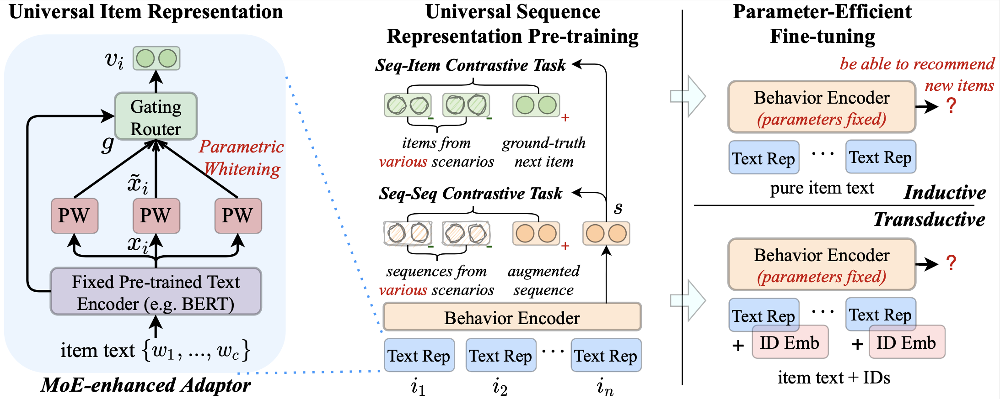

# UniSRec

This is the official PyTorch implementation for the [paper](https://arxiv.org/abs/2206.05941):
> Yupeng Hou*, Shanlei Mu*, Wayne Xin Zhao, Yaliang Li, Bolin Ding, Ji-Rong Wen. Towards Universal Sequence Representation Learning for Recommender Systems. KDD 2022.

---

*Updates*:

* [June 28, 2022] We updated some useful "mid product" files that can be obtained during the data preprocessing stage [[link]](dataset#useful-files), including:
  1. Clean item text (`*.text`);
  2. Index mapping between raw IDs and remapped IDs (`*.user2index`, `*.item2index`);
* [June 16, 2022] We released the code and scripts for  preprocessing ours datasets [[link]](dataset#dataset-preprocessing).

## Overview

We propose **UniSRec**, which stands for **Uni**versal **S**equence representation learning for **Rec**ommendation. Aiming to learn more generalizable sequence representations, UniSRec utilizes the associated description text of an item to learn transferable representations across different domains and platforms. For learning *universal item representations*, we design a lightweight architecture based on parametric whitening and mixture-of-experts enhanced adaptor. For learning *universal sequence representations*, we introduce two kinds of contrastive learning tasks by sampling multi-domain negatives. With the pre-trained universal sequence representation model, our approach can be effectively transferred to new cross-domain and cross-platform recommendation scenarios in a parameter-efficient way, under either inductive or transductive settings.



## Requirements

```
recbole==1.0.1
python==3.9.7
cudatoolkit==11.3.1
pytorch==1.11.0
```

## Download Datasets and Pre-trained Model

Please download the processed downstream (or pre-trained, if needed) datasets and the pre-trained model from [Google Drive](https://drive.google.com/drive/folders/1Uik0fMk4oquV_bS9lXTZuExAYbIDkEMW?usp=sharing) or [百度网盘](https://pan.baidu.com/s/1zdP3tEw9X6Ys5YNO5TyNEQ) (密码 3cml).

After unzipping, move `pretrain/` and `downstream/` to `dataset/`, and move `UniSRec-FHCKM-300.pth` to `saved/`.

## Quick Start

### Train and evaluate on downstream datasets

Fine-tune the pre-trained UniSRec model in transductive setting.

```
python finetune.py -d Scientific -p saved/UniSRec-FHCKM-300.pth
```

*You can replace `Scientific` to `Pantry`, `Instruments`, `Arts`, `Office` or `OR` to reproduce the results reported in our paper.*

Fine-tune the pre-trained model in inductive setting.

```
python finetune.py -d Scientific -p saved/UniSRec-FHCKM-300.pth --train_stage inductive_ft
```

Train UniSRec from scratch (w/o pre-training).

```
python finetune.py -d Scientific
```

Run baseline SASRec.

```
python run_baseline.py -m SASRec -d Scientific --config_files props/finetune.yaml --hidden_size=300
```

### Pre-train from scratch

Pre-train on one single GPU.

```
python pretrain.py
```

Pre-train with distributed data parallel on GPU:0-3.

```
CUDA_VISIBLE_DEVICES=0,1,2,3 python ddp_pretrain.py
```

### Customized Datasets

Please refer to [[link]](dataset#dataset-preprocessing) for details of data preprocessing. Then you can correspondingly try your customized datasets.

### Acknowledgement

The implementation is based on the open-source recommendation library [RecBole](https://github.com/RUCAIBox/RecBole).

Please cite the following papers as the references if you use our codes or the processed datasets.

```bibtex
@inproceedings{hou2022unisrec,
  author = {Yupeng Hou and Shanlei Mu and Wayne Xin Zhao and Yaliang Li and Bolin Ding and Ji-Rong Wen},
  title = {Towards Universal Sequence Representation Learning for Recommender Systems},
  booktitle = {{KDD}},
  year = {2022}
}


@inproceedings{zhao2021recbole,
  title={Recbole: Towards a unified, comprehensive and efficient framework for recommendation algorithms},
  author={Wayne Xin Zhao and Shanlei Mu and Yupeng Hou and Zihan Lin and Kaiyuan Li and Yushuo Chen and Yujie Lu and Hui Wang and Changxin Tian and Xingyu Pan and Yingqian Min and Zhichao Feng and Xinyan Fan and Xu Chen and Pengfei Wang and Wendi Ji and Yaliang Li and Xiaoling Wang and Ji-Rong Wen},
  booktitle={{CIKM}},
  year={2021}
}
```

Special thanks [@Juyong Jiang](https://github.com/juyongjiang) for the excellent DDP implementation ([#961](https://github.com/RUCAIBox/RecBole/pull/961)).
